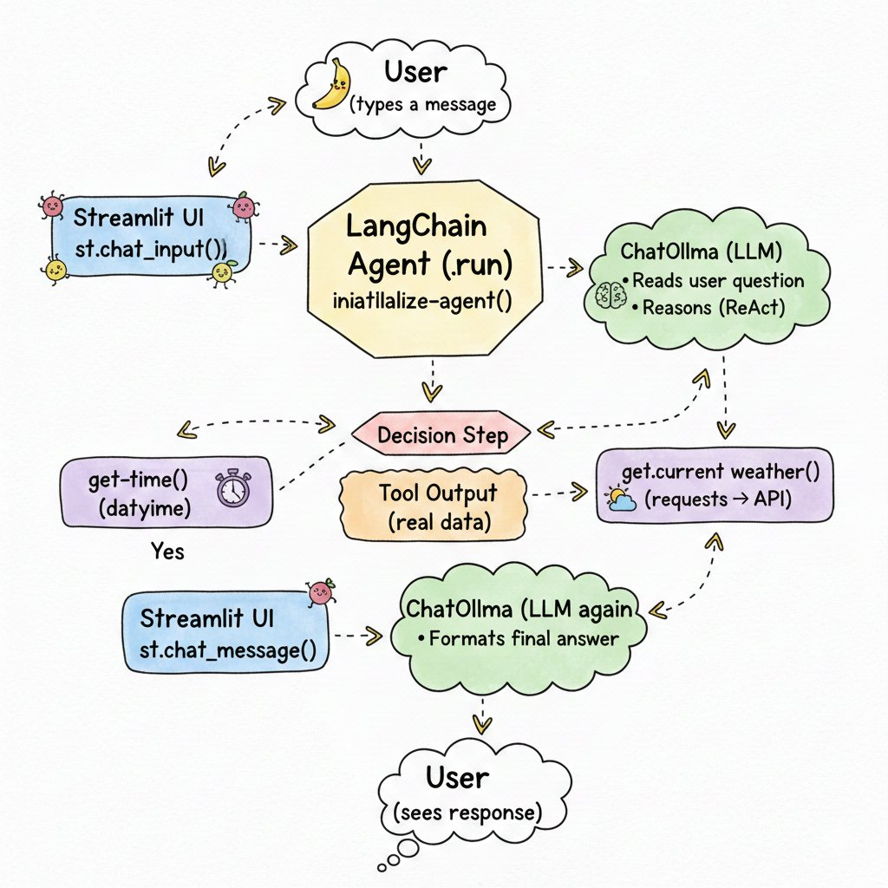

# 🦈 Sharky AI — Conversational Chatbot Evolution

A project documenting the step-by-step evolution of an AI chatbot — from a simple local LLM interface to a full agentic system with real-time tool use.

---

## 🗺️ Project Journey

```
v1_ollama  →  v3_groq  →  v3_gemini
  Local          Cloud +      Cloud +
  LLM only       Tools        Better Model
```

| Version | Stack | Features |
|---|---|---|
| `v1_ollama` | Streamlit + Ollama | Local LLM (phi3, llama3, tinyllama), streaming, chat history |
| `v3_groq` | Streamlit + LangChain + Groq | Cloud LLM, real-time weather & time tools (agentic) |
| `v3_gemini` | Streamlit + LangChain + Gemini 2.5 Flash | Best model, improved system prompt, full general knowledge |

---

## 🚀 Getting Started

### 1. Clone the repo
```bash
git clone https://github.com/YOUR_USERNAME/sharky-ai.git
cd sharky-ai
```

### 2. Set up a virtual environment
```bash
python -m venv venv
# Windows
venv\Scripts\activate
# Mac/Linux
source venv/bin/activate
```

### 3. Install dependencies for whichever version you want to run
```bash
pip install -r v1_ollama/requirements.txt   # for v1
pip install -r v3_groq/requirements.txt     # for v3 groq
pip install -r v3_gemini/requirements.txt   # for v3 gemini
```

### 4. Set up environment variables (v3 only)
```bash
cp .env.example .env
# Edit .env and add your actual API keys
```

### 5. Run the app
```bash
# v1 (requires Ollama running locally)
streamlit run v1_ollama/app.py

# v3 groq
streamlit run v3_groq/appv3.py

# v3 gemini (recommended)
streamlit run v3_gemini/appv3_gem.py
```

---

## 🔑 API Keys Required

For v3 versions, you need:

- **Groq API** (v3_groq): [console.groq.com](https://console.groq.com)
- **Google Gemini API** (v3_gemini): [aistudio.google.com](https://aistudio.google.com)
- **OpenWeatherMap API** (both v3): [openweathermap.org/api](https://openweathermap.org/api)

Add them to a `.env` file (see `.env.example`). Never commit your `.env` file.

---

## 🛠️ Tools (Agentic Features)

The v3 versions use LangChain tool calling so Sharky can:

- 🌦️ **`get_current_weather(city)`** — Fetches live weather via OpenWeatherMap API
- 🕐 **`get_current_time(timezone)`** — Returns current time for any timezone

The LLM decides autonomously when to call these tools based on the user's question.



---

## 🧰 Tech Stack

- [Streamlit](https://streamlit.io) — UI
- [Ollama](https://ollama.com) — Local LLM runner (v1)
- [LangChain](https://langchain.com) — LLM framework + tool binding
- [Groq](https://groq.com) — Fast cloud inference (v3_groq)
- [Google Gemini](https://deepmind.google/technologies/gemini/) — Best-in-class model (v3_gemini)
- [OpenWeatherMap](https://openweathermap.org) — Weather data
